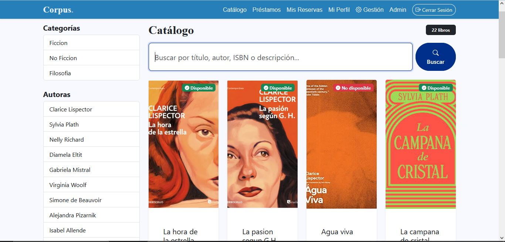

# 🌀 Corpus - Biblioteca Digital

> Sistema de gestión bibliotecaria desarrollado con Django para administrar préstamos, reservas y catálogo de libros.


---

## ◇ Descripción

**Corpus** es una aplicación web que permite gestionar una biblioteca digital enfocada en obras de autoras contemporáneas. El sistema facilita el préstamo y reserva de libros, además de proporcionar un catálogo interactivo con búsqueda y filtros avanzados.

Este proyecto fue desarrollado como parte del bootcamp de Desarrollo de Aplicaciones Full Stack Python.

---

## □ Características

- 🔍 **Catálogo interactivo** con búsqueda por título, autor e ISBN
- 📖 **Sistema de préstamos** con validaciones automáticas
- 🔖 **Reservas** para libros no disponibles
- 👤 **Gestión de usuarios** con autenticación y perfiles
- 🔐 **Control de permisos** (usuarios, bibliotecarios, administradores)
- 📊 **Panel administrativo** personalizado con Django Admin
- 📱 **Diseño responsive** con Bootstrap 5

---

## ● Tecnologías Utilizadas

- **Backend:** Python 3.x, Django 5.2.8
- **Frontend:** HTML5, CSS3, Bootstrap 5, Bootstrap Icons
- **Base de datos:** SQLite (desarrollo)
- **Gestión de imágenes:** Pillow

---

## ● Requisitos Previos

- Python 3.8 o superior
- pip (gestor de paquetes de Python)
- Git

---

## Instalación

### 1. Clonar el repositorio
```bash
git clone https://github.com/tu-usuario/biblioteca-digital.git](https://github.com/too0oori/M6_EvaluacionPortafolio_Sof-aLagos
```

### 2. Crear entorno virtual
```bash
# Windows
python -m venv myenv
myenv\Scripts\activate

# Linux/Mac
python3 -m venv myenv
source myenv/bin/activate
```

### 3. Instalar dependencias
```bash
pip install -r requirements.txt
```

### 4. Configurar base de datos
```bash
python manage.py migrate
```

### 5. Crear superusuario (opcional)
```bash
python manage.py createsuperuser
```

### 6. Ejecutar servidor de desarrollo
```bash
python manage.py runserver
```

Abre tu navegador en: **http://127.0.0.1:8000**

---

## 📁 Estructura del Proyecto
```
M6_EVALUACIONPORTAFOLIO/
├── apps/
│   ├── catalogo/          # Gestión de libros, autores y categorías
│   ├── usuarios/          # Autenticación y perfiles
│   ├── prestamos/         # Sistema de préstamos y reservas
│   ├── reportes/          # Estadísticas y reportes
│   └── core/              # Mixins y utilidades compartidas
├── templates/             # Plantillas HTML
├── static/                # Archivos estáticos (CSS, JS, imágenes)
├── media/                 # Archivos subidos (portadas de libros)
├── biblioteca_digital/    # Configuración del proyecto
└── manage.py
```

---

## ☆ Roles de Usuario

| Rol | Permisos |
|-----|----------|
| **Usuario** | Ver catálogo, solicitar préstamos, hacer reservas |
| **Bibliotecario** | Gestionar préstamos, ver reportes |
| **Administrador** | Acceso total al panel de administración |

---

## ☆ Funcionalidades Principales

### Para Usuarios
- Registro e inicio de sesión
- Búsqueda y filtrado de libros
- Solicitud de préstamos (máximo 3 activos)
- Reserva de libros no disponibles
- Renovación de préstamos (14 días adicionales)
- Visualización de historial

### Para Administradores
- Gestión completa de libros, autores y categorías
- Administración de usuarios y permisos
- Seguimiento de préstamos activos y atrasados
- Reportes de actividad

---

## ■ Capturas de Pantalla

### Página Principal


### Catálogo


### Gestión de Préstamos


---

## 🔧 Configuración Adicional

### Variables de Entorno (Producción)

Crea un archivo `.env` en la raíz:
```env
SECRET_KEY=tu-clave-secreta
DEBUG=False
ALLOWED_HOSTS=tudominio.com
```


## 🔑 Credenciales de Demo

Para probar el sistema, usa estas credenciales:

**Usuario Regular:**
- Usuario: `michi.michi`
- Contraseña: `usuario123`

**Bibliotecario:**
- Usuario: `harito.haru`
- Contraseña: `biblio123`

**Administrador:**
- Crear con: `python manage.py createsuperuser`

---

## ✦ Notas del Desarrollador

- Este proyecto utiliza SQLite para desarrollo. Para producción se recomienda PostgreSQL o MySQL.
- Las portadas de libros se almacenan en `/media/portadas/`
- El sistema valida automáticamente disponibilidad de copias antes de crear préstamos

---

## ✦ Contribuciones

Este es un proyecto académico, pero sugerencias y feedback son bienvenidos.

1. Fork el proyecto
2. Crea una rama (`git checkout -b feature/mejora`)
3. Commit tus cambios (`git commit -m 'Agregar nueva funcionalidad'`)
4. Push a la rama (`git push origin feature/mejora`)
5. Abre un Pull Request

---

## 📄 Licencia

Este proyecto fue desarrollado con fines educativos.

---

## 👤 Autor

**[Sofía Lagos]**
- GitHub: [@too0oori](https://github.com/too0oori/)
- Email: sofia.lagos.cesped@gmail.com
- Linkedin: https://www.linkedin.com/in/sofia-lagos-cesped/

---

⭐ **Si te gustó este proyecto, no olvides darle una estrella en GitHub**
